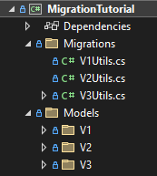

# Performing a real world schema migration in Realm
## Introduction
When dealing with databases, schema migration is a common operation that takes place during development. However, the shift toward an agile mindset has made schema migrations not an uncommon operation to be performed on production code. Since data loss in deployed applications is detrimental to a business to various degrees, today we take a look at how to perform real world schema migrations in Realm so that you can do your best when the time comes.

In order for me to show you how to perform a schema migration, we first need to set the stage so to make the code closer to what any of you may actually have to deal with. Let us think about a small business involved in shoe manufacturing that want to keep track of the business in a digital manner. Initially, the business does not need to keep track of many things, mostly supplies and the few employees who work for them. However, since the business is doing good, they manage to secure some funding for expansion. At this point, more information needs to be stored on the company's IT system to have more transparency with their investors.

How realistic my little story is, is up for debate. However, it should be able to resemble a proper series of schema migrations on production code that any of you may have to deal with.

Before we start with the deep dive, you should know that the extracts of code that you are going to see in this blog-post can be found in our [example repo](https://link.to.the.repo). The project uses [preprocessor directives](https://docs.microsoft.com/en-us/dotnet/csharp/language-reference/preprocessor-directives) to drive the various migrations; more on this later. But suffice to say that in order to see the full flow of the schema migrations you must define the *symbol* `SCHEMA_VERSION_1`, then build the project and, finally, run the resulting **dll**. Then, define `SCHEMA_VERSION_2`, rebuild and rerun the compiled binary. And as the last migration step, define `SCHEMA_VERSION_3` and redo the, already mentiond, build and run. A more in-depth guide on how to run the project can be found in `MigrationTutorial/README.md`.

### What is a schema migration?
When reading this blog-post, it is assumed that you know what a schema migration is. However, just to reiterate it very briefly, a database uses a schema to formally define how its models are structured. Those models, generally, represent rather closely the view of the world from the business' perspective. Because a business isn't static, models may change over time. These changes could be in the form of modifications, deletions, additions and merges on both fields of a model and models themselves. A schema migration is what allows to migrate the previous schema to the new one. If you are in need of a larger introduction on schema migrations, you could start by reading our [introductory documentation](https://www.mongodb.com/docs/realm/sdk/dotnet/fundamentals/schema-versions-and-migrations/).
If you have never done a migration in Realm before, you can find info on the subject in [documentation page](https://www.mongodb.com/docs/realm/sdk/dotnet/examples/modify-an-object-schema/#migration-functions). However, the gist of it is that there are two things that you need to do when you want to execute a schema migration in Realm:

1. monotonically bump up the `RealmConfiguration.SchemaVersion`
1. write a migration function and assign it to `RealmConfiguration.MigrationCallback`
What is very interesting here is what to write in the `RealmConfiguration.MigrationCallback` function. This blog-post is going to go really deep on this part.


## Code Overview
In order to help you browsing faster through the [code](https://link.to.the.repo) of this tutorial I will briefly go over the structure of the project.  
When the application starts for the first time, from `Program.Main`[(1)](#(1)-main) the realm is initialised *1)* and then seeded[^1] *2)*.

</br>

---
#### *(1) Main*
```cs
class Program
{
    static int Main()
    {
        try
        {
            RealmService.Init(); // 1)
            SeedData.Seed(); // 2)
            return 0;
        }
        catch (Exception e)
        {
            Logger.LogError($"Exception {e} was encountered.");
            return 1;
        }
    }
}
```

---

</br>

Initialisation[(2)](#(2)-initialisation-of-the-realm) is executed by `RealmService.Init`. This part of the process prepares the `RealmConfiguration` where we set the name of the database *3)*, the schema version *4)* and the migration callback *5)*. On top of these steps, the initialisation function takes also care of deleting the Realm when it realises that the user is starting over from a previous run *6)*.

</br>

---
#### *(2) Initialisation of the realm*
```cs
public class RealmService
{
    private static ulong _schemaVersion = 0;

    private static RealmConfiguration _realmConfiguration;

    public static Realm GetRealm() => Realm.GetInstance(_realmConfiguration);

    public static void Init()
    {
        if (_schemaVersion == 0)
        {
#if SCHEMA_VERSION_1
            _schemaVersion = 1;
#elif SCHEMA_VERSION_2
            _schemaVersion = 2;
#elif SCHEMA_VERSION_3
            _schemaVersion = 3;
#endif

            Logger.LogInfo($"Selected schema version: {_schemaVersion}");

            _realmConfiguration = new RealmConfiguration("migrationTutorial.realm") // 3)
            {
                SchemaVersion = _schemaVersion, // 4)

                MigrationCallback = (migration, oldSchemaVersion) => // 5)
                {
                    Logger.LogInfo("A migration has started");

#if SCHEMA_VERSION_2
                    Logger.LogInfo("The migration V2 is about to take place");
                    V2Utils.DoMigrate(migration, oldSchemaVersion);
#elif SCHEMA_VERSION_3
                    Logger.LogInfo("The migration V3 is about to take place");
                    V3Utils.DoMigrate(migration, oldSchemaVersion);
#endif
                }
            };

            var realmPath = _realmConfiguration.DatabasePath;
            if (File.Exists(realmPath) && _schemaVersion == 1) // 6)
            {
                try
                {
                    Logger.LogDebug($"Since the realm already exists and the supplied schema version is 1, it's assumed that you want to start from scratch.\n       Deleting {realmPath}");
                    Realm.DeleteRealm(_realmConfiguration);
                    Logger.LogInfo($"Realm is going to be created at:\n       {realmPath}");
                }
                catch (Exception e)
                {
                    Logger.LogWarning($"It was not possible to delete the local realm at path {realmPath} because of an exception\n{e}");
                }
            }
            else
            {
                Logger.LogInfo($"the Realm is located at:\n       {realmPath}");
            }
        }
        else
        {
            Logger.LogWarning($"You can't set the schema version more than once! It's currently set to {_schemaVersion}.");
        }
    }
}
```

---

</br>

All the models are defined in the `Models` folder and categorized under a subfolder named `V1` that holds the models of the schema version 1, a subfolder `V2` for the models of schema version 2 and so on. A similar approach is used for the migration and seeding functions that are defined under the `Migration` folder. Namely, `V1Utils` for the utilities needed for the schema version 1, `V2Utils` for those needed for the schema version 2 and so on.

</br>

img1) *Project Folder Hierarchy*



</br>

[^1]: Seeding in this context refers to the action of populating a dabatase with some dummy data.

## Multiple Schema Migrations
This tutorial would not be complete if it did not show how a schema can be migrated over multiple versions in one go, for example, from version 1 directly to version 4. Think of a device that had installed version 1 of your client (and of your schema) and never got updated throughout the various releases until the fourth iteration of the schema. 
However, showing this last bit created an issue for the tutorial: Realm finds multiple models with the same name, e.g. V1.Consumable, V2.Consumable etc
This problem was addressed by using [preprocessor directives](https://docs.microsoft.com/en-us/dotnet/csharp/language-reference/preprocessor-directives) to select the right models to be included in the compilation. This is something that should generally never be required in a real world application.

// TODO: start from here and particularly
// 1. pay attention to the numbering of the following pieces of code as they are out of sync with what was added before this. The last used ref was number 2, hence the next should start from number
// 2. Continue adding a lot of code extracts to go along with each subject you're explaining about
// 3. Add code for the various models
// 4. show better what these preprocessor directives look like in my code

 **(THIS THE FOLLOWING PART NEEDS A BIT MORE ATTENTION)** Another interesting thing to notice is that the [`migration.OldRealm`](https://docs.mongodb.com/realm-sdks/dotnet/latest/reference/Realms.Migration.html#Realms_Migration_OldRealm) needs to be accessed through the dynamic API. The reason for this is that a schema modification has just happened but you still need a way to access the old information in order to migrate it to the new schema. Accessing the previous realm dynamically is the only way to bypass the checks against the schema.

### Models and migrations
As already mentioned, there are three rounds of modifications to the models. These changes either reflect refinements over the previous models or new business needs of the company. 
The application starts with just two classes, `Consumable` and `Employee`. However, the developers realise that it is far easier to ensure the correctness of `Employee.Gender` if the field is backed by an enum instead of a string. Hence, a new migration function is created, `V2Utils.DoMigrate`, where the conversion is executed [(1)](#(1)-migrate-string-to-enum).

</br>

---
#### *(1) Migrate string to enum*
```cs
var newEmployees = migration.NewRealm.All<Employee>();
var oldEmployees = migration.OldRealm.DynamicApi.All("Employee");

for (var i = 0; i < newEmployees.Count(); i++)
{
    var newEmployee = newEmployees.ElementAt(i);
    var oldEmployee = oldEmployees.ElementAt(i);
    if (string.Equals(oldEmployee.Gender, "female", StringComparison.OrdinalIgnoreCase))
    {
        newEmployee.Gender = Gender.Female;
    }
    else if (string.Equals(oldEmployee.Gender, "male", StringComparison.OrdinalIgnoreCase))
    {
        newEmployee.Gender = Gender.Male;
    }
    else
    {
        newEmployee.Gender = Gender.Other;
    }
}
```

---

</br>
 
On top of the aforementioned improvement, the company now wants to have a list of `Supplier`-s, whom selling price of the last transaction needs to be recorded in the sold item itself. This is going to be used as a reference for the next purchase. Such addition needs a better naming for `Consumable.Price` as it is not well indicative anymore, so `LastPurchasedPrice` is chosen as a replacement. We can see this change executed in code fragment [(2)](#(2)-migration-string-to-string).  
At the same time another requirement comes in, `Consumable`-s now need to be addressed by their `ProductId` instead of some random `Id`. This will avoid in the future that an employee adds and/or finds multiple entries in the system for the same `Consumable`. From a technical stand point, all of this means that the new primary key (PK) of `Consumable` is not anymore `Id` but becomes `ProductId`. Theoretically, this change in itself requires no manual change to be executed in the migration function; it only needs the change in the `Consumable` class to update what is the new PK. However, since by definition a field that is a PK must not have duplicates, the developer team need to clean duplicates in the migration function. We can see the code for this in snippet [(3)](#(3)-deletion-of-duplicates). It is also important to note that in case the new PK has duplicates that are not removed before the `MigrationCallback` ends, when getting an instance of Realm (`Realm.GetInstance()`) the following exception is thrown:

> `Error: Exception Realms.Exceptions.RealmDuplicatePrimaryKeyValueException: Primary key property 'class_Consumable.ProductId' has duplicate values after migration.`

</br>

---
#### *(2) Migration string to string*
```cs
migration.RenameProperty(nameof(Consumable), "Price", nameof(Consumable.LastPurchasedPrice));
```
---

</br>

---
#### *(3) Deletion of duplicates*
```cs
var newConsumables = migration.NewRealm.All<Consumable>();
var oldConsumables = migration.OldRealm.DynamicApi.All("Consumable");
var distinctConsumableId = new HashSet<string>();
var consumableToDelete = new List<Consumable>();

Logger.LogInfo("In migration: rename Consumable.Price to Consumable.LastPurchasedPrice");

migration.RenameProperty(nameof(Consumable), "Price", nameof(Consumable.LastPurchasedPrice));

Logger.LogInfo("In migration: remove duplicated Consumable to accommodate ProductId to become the new primary key");

for (var i = 0; i < newConsumables.Count(); i++)
{
    var currConsumable = newConsumables.ElementAt(i);

    // remove duplicates since ProductId is the new PrimaryKey
    if (distinctConsumableId.Contains(currConsumable.ProductId))
    {
        consumableToDelete.Add(currConsumable);
    }
    else
    {
        distinctConsumableId.Add(currConsumable.ProductId);
    }
}

consumableToDelete.ForEach(x => migration.NewRealm.Remove(x));
```

---

</br>

The second migration is now concluded, as at the time there were not any other requests.  

After some time, given that the company keeps expanding, a new `Department` called `Workshop` is introduced. This `Department` is now in charge of maintaining `MachineryAndTool`-s. Because of this addition the company reclassifies two `Consumable`, `Brush` and `GlueHolder`, as `MachineryAndTool` since it is more environmentally friendly and economically advantageous to properly care for them. 
This business need requires a new migration, `V3Utils.DoMigrate`. The code for it can be see in snippet [(4)](#(4)-migrate-a-class-to-another). In it we first obtain the old `Consumable` of the needed type, then extract all the fields that are relevant to `MachineryAndTool`, create a new instance of the latter class and fill it with the extracted data, where appropriate. When all of this is done, the new instance of `MachineryAndTool` is added to the new Realm while the previous instance of `Consumable` is removed from the Realm, given that its logical representation was moved to another class (`MachineryAndTool`).

</br>

---
#### *(4) Migrate a class to another*
```cs
private static void ConvertConsumableToTool(Migration migration, ulong oldSchemaVersion, string consumableType)
{
    // it's assumed that there's always 1 and 1 only type of Consumable
    var oldConsumable = ((IQueryable<RealmObject>)migration.OldRealm.DynamicApi.All("Consumable")).Filter("_Type == $0", consumableType).FirstOrDefault();
    if (oldConsumable == null)
    {
        Logger.LogWarning($"No consumable was found with type {consumableType}. Nothing to convert.");
        return;
    }

    Supplier consumableSupplier = null;
    string consumableBrand = string.Empty;

    // no suppliers if coming from schemaVersion 1
    if (oldSchemaVersion > 1)
    {
        var supplierId = oldConsumable.DynamicApi.Get<RealmObject>("Supplier").DynamicApi.Get<ObjectId>("Id");
        consumableSupplier = migration.NewRealm.All<Supplier>().Filter("Id == $0", supplierId).FirstOrDefault();
        consumableBrand = oldConsumable.DynamicApi.Get<string>("Brand");
    }

    migration.NewRealm.Add(new MachineryAndTool()
    {
        Type = Type.ManufacturingTool,
        Status = OperationalStatus.Functioning,
        AssignedMaintainer = null,
        ToolName = oldConsumable.DynamicApi.Get<string>("_Type").ToString(),
        Supplier = consumableSupplier,
        Brand = consumableBrand
    });

    var newConsumables = migration.NewRealm.All<Consumable>();

    // ProductId could be empty because of human error
    var consumableProductId = oldConsumable.DynamicApi.Get<string>("ProductId");
    if (consumableProductId != string.Empty)
    {
        var consumableToRemove = newConsumables.Where(x => x.ProductId == consumableProductId).First();
        migration.NewRealm.Remove(consumableToRemove);
    }
}
```

---

</br>

## Conclusion
Schema migrations may sometimes be confusing to developers. This blog-post wanted to help shed more light on how to perform some common schema migrations in Realm. More specifically, the following conceptual changes have been shown:

[1)](#(1)-migrate-string-to-enum) change the backing value of a model's property (from a string to an enum)  
[2)](#(2)-migration-string-to-string) rename a property of a model  
[3)](#(3)-deletion-of-duplicates) move the Primary Key (PKs) from a model's property to another and handle the deletion of duplicated PKs  
[4)](#(4)-migrate-a-class-to-another) convert a model class into another

We hope that this blog-post covers most of your doubts when it comes to migrations in Realm. However, we do plan to also show how to migrate `EmbeddedObjects`. That surely deserves a post of its own.


(TODO all those links like (#(1)-migrate-string-to-enum) I have absolutely no way to test if they work as every flavour of markdown implements those in slightly different ways.)